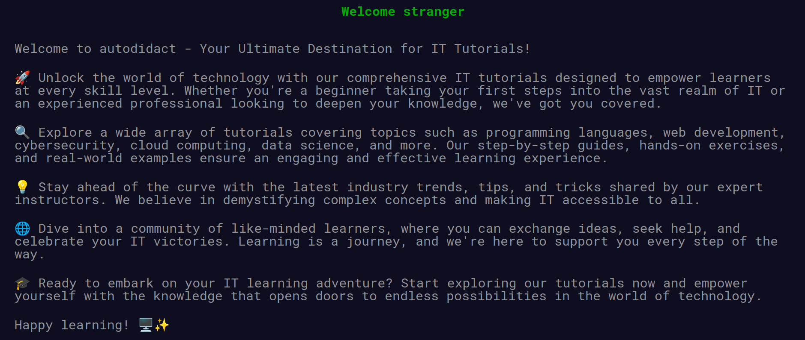
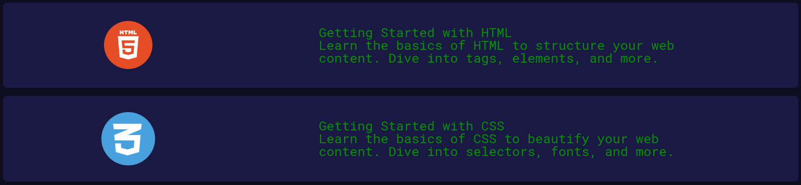

# Description
Autodidact — a web source to learn. Here you can find tutorials that throw you directly into the code, straight to the point. Learn by example and cut the bullshit. Minimalistic, short and comprehensive.

# Screenshots
### Navigation Bar

### Home

### Tutorials 

### Contacts

# Live Demo
https://github.com/Smart-Machine/tum-web-lab2/assets/53437092/a14d0498-9df7-4876-a54f-f69770eddb96